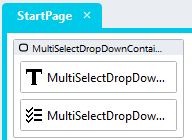

# Multi-Select DropDown

The multi-select dropdown is essentially a checkbox list that is displayed in a dropdown-like way. It is useful when you want to allow users to select from a checkbox list, but don't have the space to display the entire list

https://github.com/stadium-software/multi-select-dropdown/assets/2085324/dff8cb5a-bf6e-4028-a8b9-4e94b2745792

## Version
1.0

<hr>

## Application Setup
1. Check the *Enable Style Sheet* checkbox in the application properties

## Multi-Select-DropDown

1. Drag a *Container* control to a page and call it "MultiSelectDropDownContainer"
2. Add the class "multi-select-dropdown-container" to the classes property
3. Drag a *Label* control into the container and call it "MultiSelectDropDownHeader"
4. Add "Filter" into the *Text* property of the "MultiSelectDropDownHeader" control
5. Add the class "multi-select-dropdown-header" to the classes property
6. Drag a *CheckboxList* control into the container, place it under the label control and call it "MultiSelectDropDownCheckBoxList"
7. Add the class "multi-select-checkboxlist" to the classes property
8. Paste the array below into the *Options* property to create some sample items
```json
[{"text":"Item1","value":"Item1"},{"text":"Item2","value":"Item2"},{"text":"Item3","value":"Item3"},{"text":"Item4","value":"Item4"}]
```



## Page.Load Event Handler

1. Drag a Javascript action into the Page.Load event handler
2. Copy the Javascript below into the *code* property of the action
```javascript
document.querySelector(".multi-select-dropdown-header").addEventListener("click", function(e){
	e.target.closest(".multi-select-dropdown-container").classList.toggle("expand");
});
document.body.addEventListener("click", function(e){
	if (!e.target.closest(".multi-select-dropdown-container")) {
		let allDD = document.querySelectorAll(".multi-select-dropdown-container");
		for (let i=0;i<allDD.length;i++){
			allDD[i].classList.remove("expand");
		}
	}
});
```

## Customising the multi-select dropdown
The *multi-select-variables.css* file included in this repo contains a set of variables that can be changed to customise the multi-select multi-select dropdown. Follow the steps below to create a custom multi-select dropdown implementation 
1. Open the CSS file called [*multi-select-variables.css*](multi-select-variables.css) from this repo in an editor of your choice (I recommend [VS Code](https://code.visualstudio.com/))
2. Adjust the variables in the *:root* element as you see fit

## Applying the CSS
How to apply the CSS to your application
1. Create a folder called *CSS* inside of your Embedded Files in your application
2. Drag the two CSS files from this repo [*multi-select-variables.css*](multi-select-variables.css) and [*multi-select.css*](multi-select.css) into that folder

#### Stadium 6 (versions 6.6 and above)
1. Paste the link tags below into the *head* property of your application
```html
<link rel="stylesheet" href="{EmbeddedFiles}/CSS/multi-select.css">
<link rel="stylesheet" href="{EmbeddedFiles}/CSS/multi-select-variables.css">
``` 

## CSS Upgrading
To upgrade thje CSS in this module, follow the [steps outlined in this repo](https://github.com/stadium-software/samples-upgrading)
